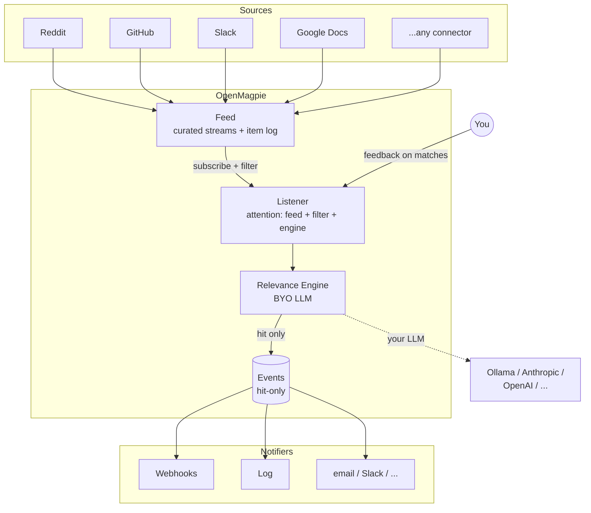

<p align="center">
  
</p>

<p align="center">
  An open-source semantic listener. Tell it what to listen for. It picks out what matters from any stream.
</p>

<p align="center">
  <a href="LICENSE"></a>
</p>

---

## What is OpenMagpie?

OpenMagpie is a self-hostable listening tool. Point it at any stream (Reddit, GitHub, Slack, Google Docs, anything that emits events) and describe in plain English what you care about, and it surfaces the matches that matter. It gets better at hearing you over time as you give feedback on its picks.

It is **only** a listener: it watches, judges, learns, and notifies. It does not auto-reply, post back to sources, run workflows, or generate reports. Saying no to those keeps the product sharp.

## Architecture



## Features

- **Feed → Listener primitive**: `Feed`s are reusable, curated streams (e.g. `r/ClaudeAI` + `r/AI_Agents`). `Listener`s subscribe to a Feed and apply a plain-English filter via your engine. One feed, many listeners; pay for source polling once.
- **Source-agnostic**: every connector yields a typed `Observation`; engines and notifiers operate on the same shape no matter the source.
- **Plain-English listeners**: describe what you care about; no filter chains, no DSL.
- **Bring your own LLM**: Ollama (local) today; the `Engine` Protocol + `validate_model` hook makes adding Anthropic/OpenAI/others a four-file change with no listener-layer churn.
- **Hit-only persistence**: `Event`s exist in the DB only when a Listener's engine judged the observation relevant. Misses live and die in memory.
- **Instant or digest delivery**: fire notifiers per-hit, or batch them on a cadence.
- **Pluggable notifiers**: webhook + log out of the box; same `Notifier` Protocol for adding Slack/email/etc.
- **Per-receiver payload preview**: `magpie listener payload-sample <id>` runs the same `render()` your real webhook would, so you can wire and test receivers without firing real hits.
- **Cursor rewind**: `magpie listener rewind <id>` re-judges the retention window after you refine instructions or lower a threshold.
- **Self-hostable**: Django + SQLite; Docker Compose dev loop; your data and credentials stay yours.

### Planned (not yet shipped)

- **Learns from feedback**: ✅/❌ on past hits become few-shot examples for the next pass. Engine layer is in place; the feedback ingest + retrieval loop is the open piece.

### What's implemented today

| Layer | Shipped |
|---|---|
| Connectors | Reddit (`reddit_subreddit`) |
| Engines | Ollama (`ollama`) |
| Notifiers | Webhook, Log |
| Listener kinds | Semantic (LLM-judged) |

## Quick start

### Prereq: an Ollama instance to talk to

OpenMagpie is BYO LLM. The dev stack doesn't bundle one; you point at an Ollama instance you control. Two common shapes:

- **Local Ollama (the default).** `OLLAMA_URL=http://host.docker.internal:11434` already points at your local Ollama. If you don't have one: `brew install ollama` (macOS, or [linux install](https://ollama.com/download)), `ollama pull qwen2.5:7b`, `ollama serve`.
- **Remote Ollama (LAN box, GPU server, cloud).** Set `OLLAMA_URL=http://your-host:11434` in `apps/core/.env`. Useful if your dev machine is CPU-only and you've got a GPU box elsewhere.

Pull whichever model you want to judge with; set `OLLAMA_DEFAULT_MODEL` to its name. Latency on a 7B model is ~1-3s per judge on Apple Silicon and similar on a recent NVIDIA GPU; CPU-only is workable but slower.

### Run the stack

```bash
git clone git@github.com:obris-dev/openmagpie.git
cd openmagpie
cp apps/core/.env.example apps/core/.env

make build           # build and start Django + the web app
make dev-migrate     # run migrations, create cache table, bootstrap the CLI OAuth app
```

Then either:

**Browser**: visit http://localhost:3001 and create an account; you'll be signed in.

**CLI**: install + sign in, then run the wizard.

```bash
make dev-cli-sync                       # uv sync into the workspace .venv
make dev-cli ARGS="auth login"          # opens browser device flow
# Sign in, click Authorize, return to the terminal.
make dev-cli ARGS="quickstart"          # two questions, one working listener
make dev-tick                           # poll + judge once now (vs waiting for the scheduler)
```

`magpie quickstart` creates a feed + listener pair with sensible defaults and offers an optional backfill window so the first poll has real posts to score. Pick the demo path and you'll see actual hits scored against your criteria in ~30 seconds.

Or invoke directly: `cd apps/cli && uv run magpie auth login`. Run `uv tool install ./apps/cli` to put `magpie` on your `PATH` globally.

Useful targets (run `make help` for the full list):

```
make up              # start the stack
make down            # tear down
make logs            # tail everything
make dev-manage CMD=createsuperuser
make dev-dbshell     # open SQLite shell
make dev-test        # run Django test suite
make dev-lint        # ruff + whitespace / final-newline
make dev-types       # ty static type check
make dev-check       # lint + types + tests
```

## Project structure

uv workspace; one root `uv.lock` for everything Python.

```
apps/
  core/                       Django backend (deployable)
    common/                   BaseModel (ULID PK + timestamps), ULIDField, /healthz
    accounts/                 User / Account / UserProfile + services + AccountScopedAPIView mixin
    auth_api/                 signup / login / logout / me + tokens/* + device-flow handshake (DRF)
    feeds/                    Feed + FeedItem models + poll orchestrator + item log
    listeners/                Listener model + Pydantic config + judgment + preview services
    events/                   Event model (hit = a kind of event) + Observation hierarchy + registry
    sources/                  Connectors (Reddit subreddit, ...) + observation classes
    engine/                   Engine Protocol + OllamaEngine package + registry
    notifications/            Notifier Protocol (Webhook, Log) + instant/digest delivery + render() preview
    conf/                     settings (base/local), urls, wsgi
  cli/                        magpie CLI (Typer + httpx + Pydantic); distributed as a standalone wheel
packages/
  openmagpie-schema/          Pure Pydantic models shared by core + cli (configs, wire types, feed shapes)
web/                          pnpm workspace: apps/app (Next.js) + packages/{ui,api-utils,auth,tailwind-config}
make/                         Per-concern Makefile targets
scripts/                      Helper scripts (whitespace check, make-help)
```

See [AGENTS.md](AGENTS.md) for design conventions (char pointers, typed-blob pattern, hit-only persistence, etc.).

## License

OpenMagpie is open source under the [Apache License 2.0](LICENSE), with optional enterprise directories (`**/ee/`) reserved for future commercial features.
