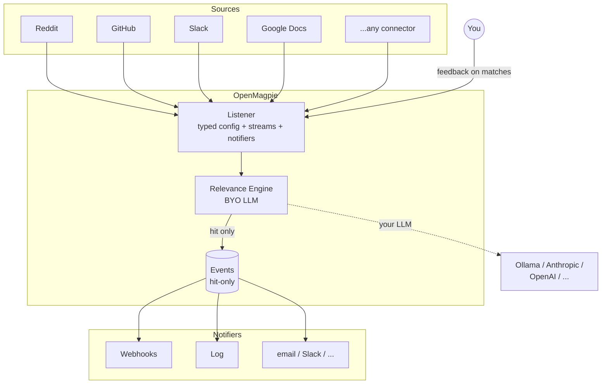

<p align="center">
  
</p>

<p align="center">
  An open-source semantic listener. Tell it what to listen for. It picks out what matters from any stream.
</p>

<p align="center">
  <a href="LICENSE"></a>
</p>

---

## What is OpenMagpie?

OpenMagpie is a self-hostable listening tool. Point it at any stream — Reddit, GitHub, Slack, Google Docs, anything that emits events — describe in plain English what you care about, and it surfaces the matches that matter. It gets better at hearing you over time as you give feedback on its picks.

It is **only** a listener: it watches, judges, learns, and notifies. It does not auto-reply, post back to sources, run workflows, or generate reports. Saying no to those keeps the product sharp.

## Architecture



## Features

- **Source-agnostic** — every connector yields a typed `Observation`; engines and notifiers operate on the same shape no matter the source
- **Plain-English listeners** — describe what you care about; no filter chains, no DSL
- **Bring your own LLM** — Ollama (local), or future Anthropic/OpenAI/etc. via the engine plugin protocol
- **Hit-only persistence** — Events exist in the DB only when a Listener's engine judged the observation relevant. Misses live and die in memory.
- **Learns from feedback** — ✅/❌ on past hits become few-shot examples for the next pass (planned; engine layer is in place)
- **Instant or digest delivery** — fire notifiers per-hit, or batch them on a cadence
- **Pluggable notifiers** — webhook out of the box; more to come
- **Self-hostable** — Django + SQLite for v0; Docker Compose dev loop; your data and credentials stay yours

## Quick start

```bash
git clone git@github.com:obris-dev/openmagpie.git
cd openmagpie
cp core/.env.example core/.env

make build           # build and start Django + the web app
make dev-migrate     # run migrations, create cache table, bootstrap the CLI OAuth app
```

Then either:

**Browser**: visit http://localhost:3001 — create an account, you'll be signed in.

**CLI**: install + sign in.

```bash
make dev-cli-sync                       # uv sync into cli/.venv
make dev-cli ARGS="auth login"          # opens browser device flow
# Sign in, click Authorize, return to the terminal.
make dev-cli ARGS="auth status"
```

Or invoke directly: `cd cli && uv run magpie auth login`. Run `uv tool install ./cli` to put `magpie` on your `PATH` globally.

Useful targets (run `make help` for the full list):

```
make up              # start the stack
make down            # tear down
make logs            # tail everything
make dev-manage CMD=createsuperuser
make dev-dbshell     # open SQLite shell
make dev-test        # run Django test suite
make dev-lint        # ruff + whitespace / final-newline
make dev-types       # ty static type check
make dev-check       # lint + types + tests
```

## Project structure

```
core/
  common/          BaseModel (ULID PK + timestamps), ULIDField, /healthz
  accounts/        User / Account / UserProfile + services
  auth_api/        signup / login / logout / me + tokens/* + device-flow handshake (DRF)
  listeners/       Listener model + Pydantic config + polling orchestrator
  events/          Event model + Observation hierarchy + registry
  sources/         Connectors (Reddit subreddit, ...) + observation classes
  engine/          Engine Protocol + OllamaEngine + registry
  notifications/   Notifier Protocol (Webhook, Log) + instant/digest delivery
  conf/            settings (base/local), urls, wsgi
web/               pnpm workspace: apps/app (Next.js) + packages/{ui,api-utils,auth,tailwind-config}
cli/               magpie CLI (Typer + httpx + Pydantic)
make/              Per-concern Makefile targets
scripts/           Helper scripts (whitespace check, make-help)
```

See [AGENTS.md](AGENTS.md) for design conventions (char pointers, typed-blob pattern, hit-only persistence, etc.).

## License

OpenMagpie is open source under the [Apache License 2.0](LICENSE), with an optional enterprise directory (`ee/`) reserved for future commercial features.
