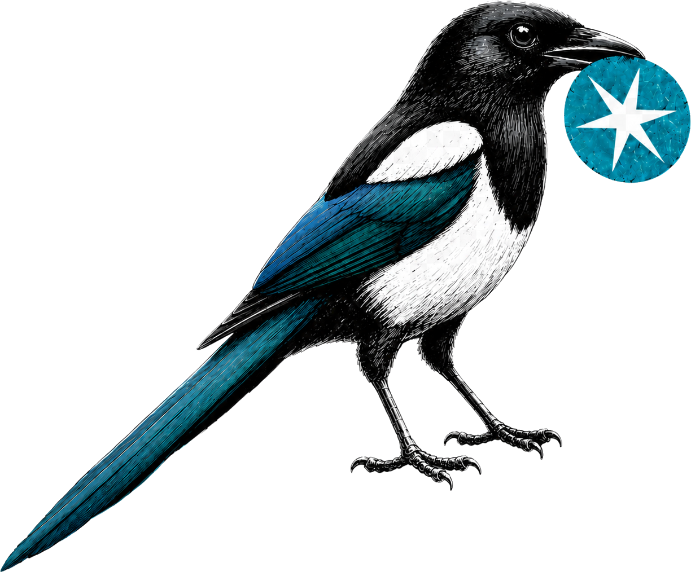
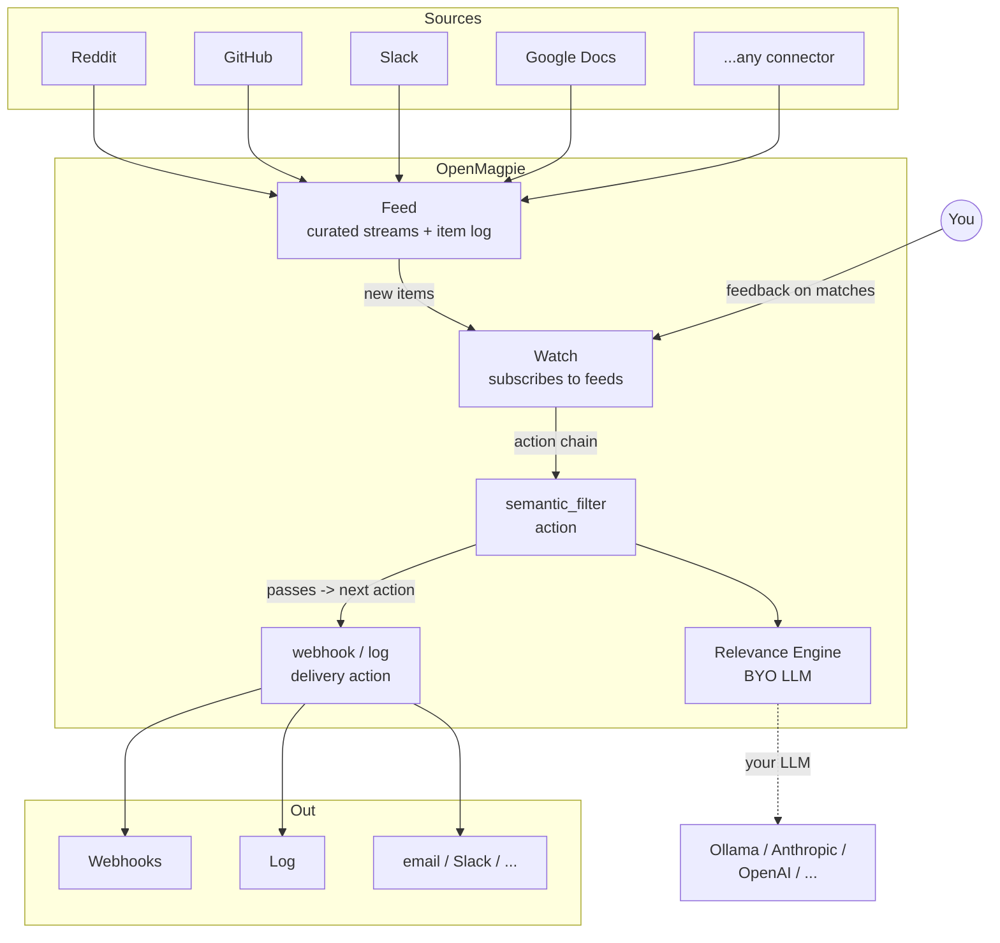

<p align="center">
  
</p>

<p align="center">
  An open-source semantic listener. Tell it what to listen for. It pulls out what matters.
</p>

<p align="center">
  <a href="LICENSE"></a>
</p>

---

## What is OpenMagpie?

OpenMagpie is a self-hostable listening tool. Point it at any stream (Reddit, RSS Feeds, GitHub, Slack, Google Docs, anything that you find yourself checking repeatedly) and describe in plain English what you care about, and OpenMagpie surfaces the matches.

## Architecture



## Features

- **Feed → Watch primitive**: `Feed`s are reusable, curated streams (e.g. `r/ClaudeAI` + `r/AI_Agents`). A `Watch` subscribes to one or more Feeds and runs an ordered **action chain** over each new item. One feed, many watches; pay for source polling once.
- **Composable action chain**: a watch is a sequence of actions — a `semantic_filter` (plain-English, LLM-judged) gates the chain, and downstream `webhook` / `log` actions deliver what passes. Filters and deliveries are siblings, not a fixed pipeline.
- **Source-agnostic**: every connector yields a typed `SourcePayload`; engines and actions operate on the same shape no matter the source.
- **Bring your own LLM**: Ollama (local) today; the `Engine` Protocol + `validate_model` hook makes adding Anthropic/OpenAI/others a small change with no watch-layer churn.
- **Per-run audit log**: every action execution is a `WatchActionRun` row (pending → succeeded / gated / failed / errored), inspectable via `magpie watch action activity`. A filter that scores below threshold is `gated` and stops the chain.
- **Instant or digest delivery**: delivery actions fire per item, or batch a rolling window into one emission on a cadence.
- **Pluggable action kinds**: `semantic_filter`, `webhook`, `log` out of the box; one config class + one impl + two registry entries to add a kind.
- **Self-hostable**: Django + Postgres; Docker Compose dev loop; your data and credentials stay yours.

### Planned (not yet shipped)

- **Learns from feedback**: ✅/❌ on past matches become few-shot examples for the next pass. Engine layer is in place; the feedback ingest + retrieval loop is the open piece.
- **Branching & parallel chains**: the data model already carries `WatchPath` (parallel chains) and dense action ranks; multi-path and DAG branching are post-v1.

### What's implemented today

| Layer | Shipped |
|---|---|
| Connectors | Reddit (`reddit_subreddit`) |
| Engines | Ollama (`ollama`) |
| Action kinds | `semantic_filter` (LLM-judged), `webhook`, `log` |
| Delivery modes | instant, digest |

## Quick start

### Prereq: an Ollama instance to talk to

OpenMagpie is BYO LLM. The dev stack doesn't bundle one; you point at an Ollama instance you control. Two common shapes:

- **Local Ollama (the default).** `OLLAMA_URL=http://host.docker.internal:11434` already points at your local Ollama. If you don't have one: `brew install ollama` (macOS, or [linux install](https://ollama.com/download)), `ollama pull qwen2.5:7b`, `ollama serve`.
- **Remote Ollama (LAN box, GPU server, cloud).** Set `OLLAMA_URL=http://your-host:11434` in `apps/core/.env`. Useful if your dev machine is CPU-only and you've got a GPU box elsewhere.

Pull whichever model you want to judge with; set `OLLAMA_DEFAULT_MODEL` to its name. Latency on a 7B model is ~1-3s per judge on Apple Silicon and similar on a recent NVIDIA GPU; CPU-only is workable but slower.

### Run the stack

```bash
git clone git@github.com:obris-dev/openmagpie.git
cd openmagpie
cp apps/core/.env.example apps/core/.env

make build           # build and start Django + the web app
make dev-migrate     # run migrations, create cache table, bootstrap the CLI OAuth app
```

Then either:

**Browser**: visit http://localhost:3001 and create an account; you'll be signed in.

**CLI**: install + sign in, then create a feed and a watch over it.

```bash
make dev-cli-sync                       # uv sync into the workspace .venv
make dev-cli ARGS="auth login"          # opens browser device flow
# Sign in, click Authorize, return to the terminal.

make dev-cli ARGS="feed create"         # opens $EDITOR on a feed template (sources + retention)
make dev-cli ARGS="watch create"        # opens $EDITOR on a watch template (feeds + action chain)
make dev-tick                           # poll + run the chain once now (vs waiting for the scheduler)

make dev-cli ARGS="watch action activity <watch_id> <action_id>"   # inspect the run log
```

A watch's `actions:` chain typically starts with a `semantic_filter` (your plain-English criteria + threshold) followed by a `webhook` or `log` delivery. Pick a backfill window when you create the feed and the first `make dev-tick` scores real posts against your criteria immediately, no waiting for the scheduler.

Or invoke directly: `cd apps/cli && uv run magpie auth login`. Run `uv tool install ./apps/cli` to put `magpie` on your `PATH` globally.

Useful targets (run `make help` for the full list):

```
make up              # start the stack
make down            # tear down
make logs            # tail everything
make dev-manage CMD=createsuperuser
make dev-dbshell     # open a psql shell on the Postgres db
make dev-test        # run Django test suite
make dev-lint        # ruff + whitespace / final-newline
make dev-types       # ty static type check
make dev-check       # lint + types + tests
```

## Project structure

uv workspace; one root `uv.lock` for everything Python.

```
apps/
  core/                       Django backend (deployable)
    common/                   BaseModel (ULID PK + timestamps), ULIDField, locks, db ceilings, /healthz
    accounts/                 User / Account / UserProfile + services + AccountScopedAPIView mixin
    auth_api/                 signup / login / logout / me + tokens/* + device-flow handshake (DRF)
    sources/                  Connectors (Reddit subreddit, ...) + SourcePayload classes + registry
    feeds/                    Feed + Source + FeedItem models + poll orchestrator + item log
    engine/                   Engine Protocol + OllamaEngine package + registry
    watches/                  Watch + WatchFeed + WatchPath + WatchAction + WatchActionRun (chain + trigger/drain/flush crons)
    conf/                     settings (base/local), urls, wsgi
  cli/                        magpie CLI (Typer + httpx + Pydantic); distributed as a standalone wheel
packages/
  openmagpie-schema/          Pure Pydantic models shared by core + cli (configs, wire types, feed shapes)
web/                          pnpm workspace: apps/app (Next.js) + packages/{ui,api-utils,auth,tailwind-config}
make/                         Per-concern Makefile targets
scripts/                      Helper scripts (whitespace check, make-help)
```

See [AGENTS.md](AGENTS.md) for design conventions (char pointers, typed-blob pattern, the watch trigger/drain/flush execution model, etc.).

## License

OpenMagpie is open source under the [Apache License 2.0](LICENSE), with optional enterprise directories (`**/ee/`) reserved for future commercial features.
